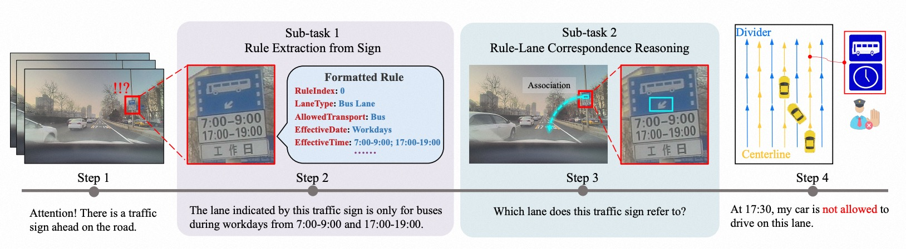
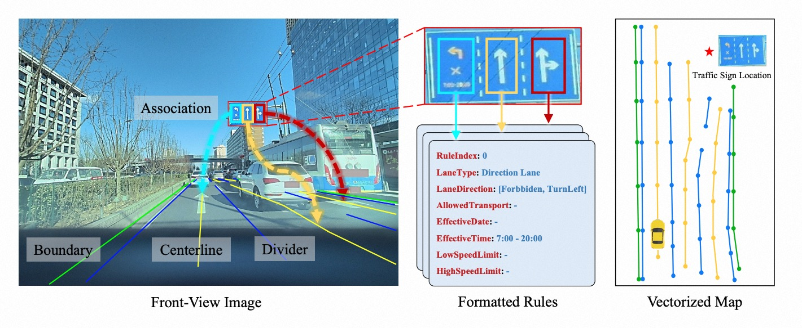

<div id="top" align="center">

# MapDR

A Benchmark for Integrating Traffic Sign Regulations into Vectorized HD Map


</div>

> - [Paper] [CVPR 2025 Highlight] [Driving by the Rules: A Benchmark for Integrating Traffic Sign Regulations into Vectorized HD Map](https://arxiv.org/abs/2410.23780)
> - [Code] [MIV-XJTU/MapDR](https://github.com/MIV-XJTU/MapDR)
> - [Homepage] [miv-xjtu.github.io/MapDR](https://miv-xjtu.github.io/MapDR/)
> - [Dataset] [MapDR](https://modelscope.cn/datasets/MIV-XJTU/MapDR) & [MapDR-mini](https://modelscope.cn/datasets/MIV-XJTU/MapDR-mini)
> - [Model] [RuleVLM](https://modelscope.cn/models/MIV-XJTU/RuleVLM/summary)

## Table of Contents

- [Task & Evaluation](#task--evaluation)
- [Highlights of MapDR](#highlights-of-mapdr)
- [Getting Started](#getting-started)
- [License & Citation](#license--citation)

## Task & Evaluation  

### Overall

The ability to discern rules from traffic signs and to associate them with specific lanes is pivotal for autonomous navigation. The overall task focuses on extracting lane-level driving rules and reasoning the correspondence between these rules and the centerlines in the local vectorized HD map.

The final correspondence forms a bipartite graph for [evaluation](./evaluate/metric.md).



### Rule Extraction

R.E. sub-task involves extracting multiple rules from a series of image sequences. The _Precision_ and _Recall_ of driving rules serve as the [evaluation metric](./evaluate/metric.md#rule-extraction).

### Rule-Lane Correspondence Reasoning

C.R. sub-task aims to evaluate the capacity to establish the correspondence between driving rules and centerlines in the local HD map. The _Precision_ and _Recall_ of driving rules serve as the [evaluation metric](./evaluate/metric.md#correspondence-reasoning).

## Highlights of MapDR

MapDR dataset meticulously annotated with traffic sign regulations and their correspondences to lanes. The dataset encompasses a diverse range of scenarios, weather conditions, and traffic situations, with over $10,000$ traffic scene segments, $18,000$ driving rules, and $400,000$ images.



### Lane-Level Driving Rules

Each video clip in MapDR may contain multiple lane-level rules, denoted as $R$. Each rule is expressed by symbols and text on the sign, requiring interpretation.
We reference existing HD map design and data specificationsto define lane-level driving rules in the JSON format. Each rule $r_i$ comprises $8$ predefined properties in the form of $\{key:value\}$ pairs.
This definition schema encompasses most scenarios and supports integration into existing autonomous driving systems.
We enclose the symbols and texts denoting each distinct rule on traffic signs with polygons and project them into 3D space as $P_i = [p_1, \dots, p_n]$, where $n$ varies.

### Correspondence between Rules and Centerlines

Based on formatted rules $R$ and centerlines $L$, corresponding centerlines of each rule are annotated in MapDR dataset. Therefore correspondence between rules and centerlines can be formed as a bipartite graph $G = (R \cup L,E)$, where $E\subseteq\{0,1\}^{|R|\times|L|}$ and the positive edges only exist between $R$ and $L$. Specifically, $E_{ij} = 1$ represents that vehicle driving on the lane with centerline $l_j$ should follow the driving rule $r_i$.

## Getting Started

First Download dataset from [MapDR](https://modelscope.cn/datasets/MIV-XJTU/MapDR) or [MapDR-mini](https://modelscope.cn/datasets/MIV-XJTU/MapDR-mini).

### Prepare Full Dataset

```bash
# First concatenate the full dataset
cat mapdr_* > mapdr.tar.gz

# unzip the full dataset
tar xvzf mapdr.tar.gz
```

### Create Dataset Visualization

```python
# Create a video for target case
# Example: python visualize/visualize.py /mapdr_mini/BusLane/0cdea530a3c24022b22a7320ad2e4818 ./visualization
python visualize/visualize.py path/to/data path/to/save 
```

### Reproduce Baseline Approach

The inference code and adapter weights of End-to-End baseline approach RuleVLM proposed in the paper is released. Researcher can reproduce the evaluation following [RuleVLM](https://modelscope.cn/models/MIV-XJTU/RuleVLM/summary).

## License & Citation

> MapDR is distributed under [CC BY-NC-SA 4.0](https://creativecommons.org/licenses/by-nc-sa/4.0) license.

Please use the following citation when referencing MapDR:

```bibtex
@misc{chang2025drivingrulesbenchmarkintegrating,
      title={Driving by the Rules: A Benchmark for Integrating Traffic Sign Regulations into Vectorized HD Map}, 
      author={Xinyuan Chang and Maixuan Xue and Xinran Liu and Zheng Pan and Xing Wei},
      year={2025},
      eprint={2410.23780},
      archivePrefix={arXiv},
      primaryClass={cs.CV},
      url={https://arxiv.org/abs/2410.23780}, 
}
```
