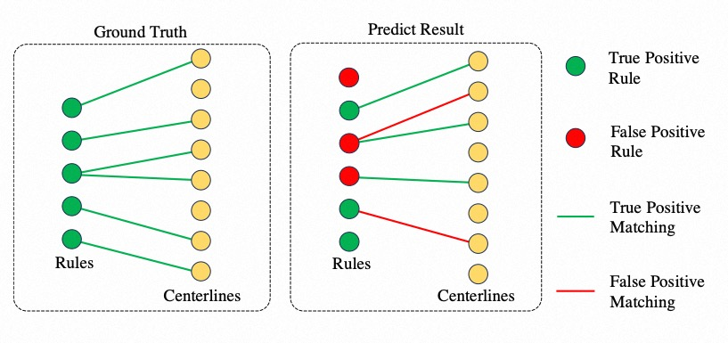

# Evaluation Metric

To independently investigate the capabilities of rule extraction and correspondence reasoning within the overall task, we further divided the overall task into two sub-tasks, defined as follows.



## Rule Extraction

Given the ground truth $R$ and predicted rules $\hat{R}$, we propose to calculate the $Precision$ ($P_{R.E.}$) and $Recall$ ($R_{R.E.}$) to evaluate the capability of rules extraction, where $ \hat{r_i} = r_i $ represents all the properties are predicted correctly.

```math
P_{R.E.} = \frac{| \hat{R} \cap R |}{|\hat{R}|} =  \frac{3}{6} 
  \qquad R_{R.E.} = \frac{|\hat{R} \cap R | }{| R | } =  \frac{3}{5}
```

## Correspondence Reasoning

Given the ground truth of correspondence bipartite graph $G = (R \cup L,E)$ and predicted graph $\hat{G} = (R \cup L,\hat{E})$, we propose to calculate $Precision$ ($P_{C.R.}$) and $Recall$ ($R_{C.R.}$) of edge set $E$ to evaluate the capability of correspondence reasoning individually.

```math
  P_{C.R.} = \frac{| \hat{E} \cap E |}{|\hat{E}|} =  \frac{3}{5}   
  \qquad R_{C.R.} = \frac{| \hat{E} \cap E | }{| E |} =  \frac{3}{6}
```

## Overall

The final predicted results can be obtained through an end-to-end prediction or a combination of two sequential sub-tasks.
Given the predicted rules, correspondence should be reasoned between $\hat{R}$ and $L$ which means the prediction of entire task is $\hat{G} = (\hat{R} \cup L, \hat{E})$ and the ground truth is consistent $G = (R \cup L, E)$.
We evaluate $Precision$ ($P_{all}$) and $Recall$ ($R_{all}$) using the sub-graph $G^{s}$, where $G^{s} = \{ g^{s}_{ij}\}_{i=1, j=1}^{m, k}, { g^{s}_{ij} = (\{r_i, l_j\}, e_{ij})} $. In set of sub-graph $G^{s}$, $m$ is the number of rules, and $k$ is the number of centerlines.
Furthermore, we propose the $F_1$ for the final benchmark ranking. The $F_1$ is derived from the calculations of $P_{all}$ and $R_{all}$.

```math
    P_{all} = \frac{| \hat{G^{s}} \cap G^{s} |}{|\hat{G^{s}}|} =  \frac{1}{5}  
  \qquad R_{all} = \frac{|\hat{G^{s}} \cap G^{s}|}{|G^{s}| }=  \frac{1}{6}
```

```math
    F_1 = 2 \times \frac{P_{all} \times R_{all}}{P_{all} + R_{all}}
```
